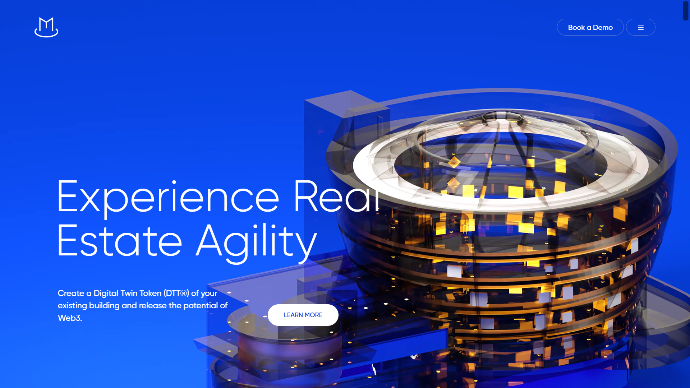

# Magma Website Clone

This is a clone of the [Magma](https://thisismagma.com) website. This project replicates the visual design and user experience of the original website.

## Table of Contents
- [Overview](#overview)
- [Screenshots](#shots)
- [Technologies Used](#technologies-used)

## Overview
This project is a clone of the Magma website, created for educational purposes to demonstrate web development and design skills. The clone aims to match the aesthetics and functionality of the original site as closely as possible.

## Shots

### Home Page

### Contact Page

## Technologies Used
This project utilizes a range of modern web development technologies:

- **HTML5**: For the structure of the web pages.
- **CSS3**: For styling and layout, including Flexbox and Grid.
- **JavaScript**: For interactive elements and dynamic content.
- **GSAP (GreenSock Animation Platform)**: For creating animations and transitions.
- **Lenis**: For better scrolling AAnimations.